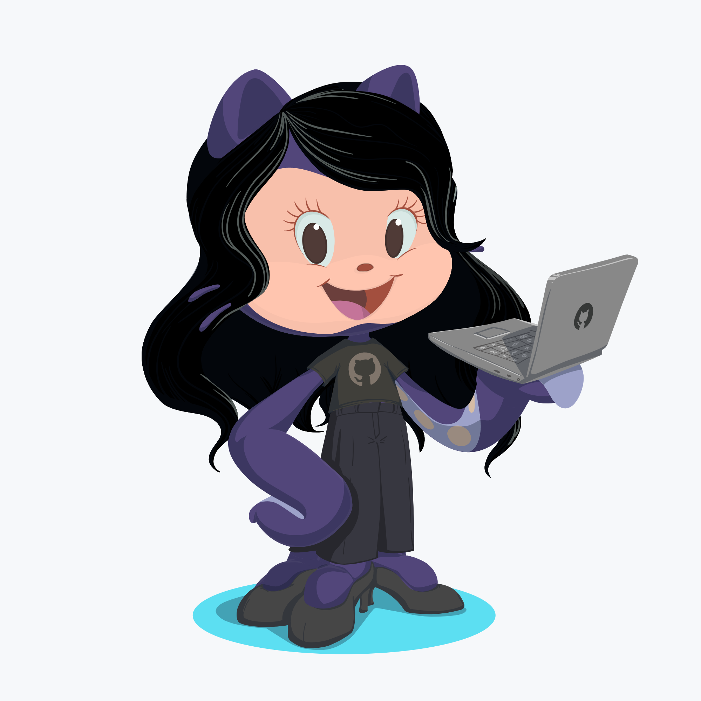

### Hi there 👋

💬 Opinions and views here are my own, not of my employer!

🔭 I've a extensive background as a Database Administrator and Data Engineer.

🌱 Now I'm in a new jorney in data world: I'm learning how to extract a better insights with data as a Data Scientist. Here you will found some studies that I've done in my life and I hope this information help you in your carrier.

👯 I love to contribute in data communities.

😄 If I can help you in something, don't exitate to tell me!

🤔 You can reach me at:

📫: https://linktr.ee/erikanagamine

✨ My content here is in Portuguese and English.

<!--
**erikanagamine/erikanagamine** is a ✨ _special_ ✨ repository because its `README.md` (this file) appears on your GitHub profile.

Here are some ideas to get you started:

- 🔭 I’m currently working on ...
- 🌱 I’m currently learning ...
- 👯 I’m looking to collaborate on ...
- 🤔 I’m looking for help with ...
- 💬 Ask me about ...
- 📫 How to reach me: ...
- 😄 Pronouns: ...
- ⚡ Fun fact: ...
-->
